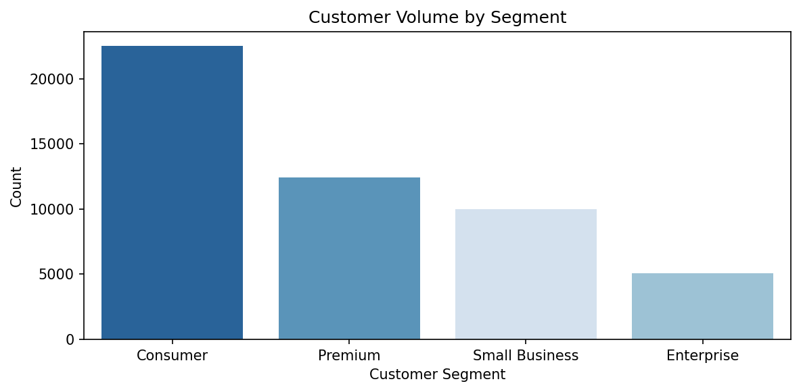
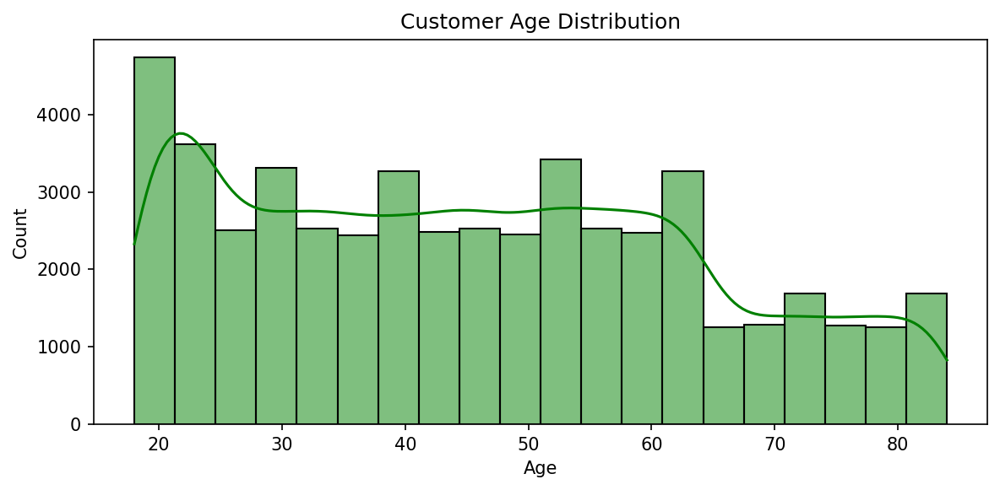
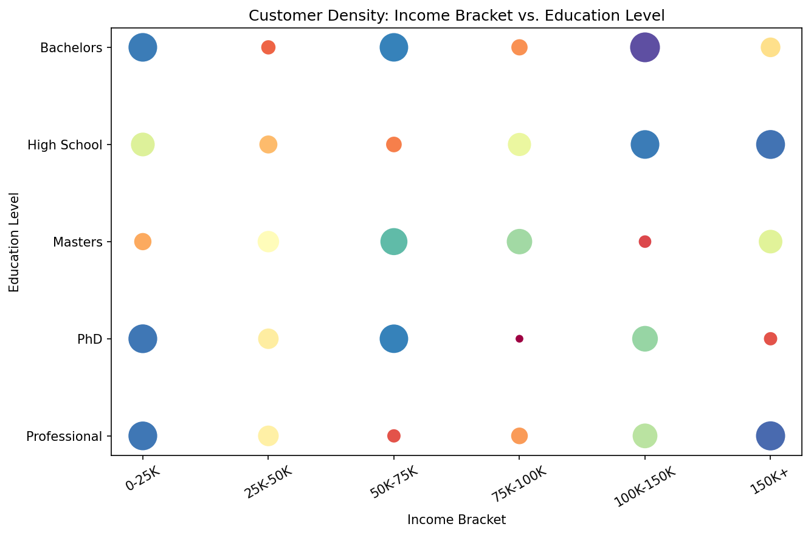
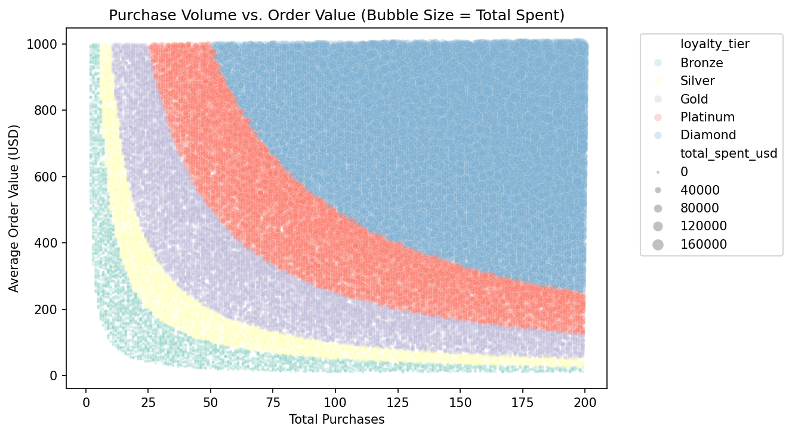
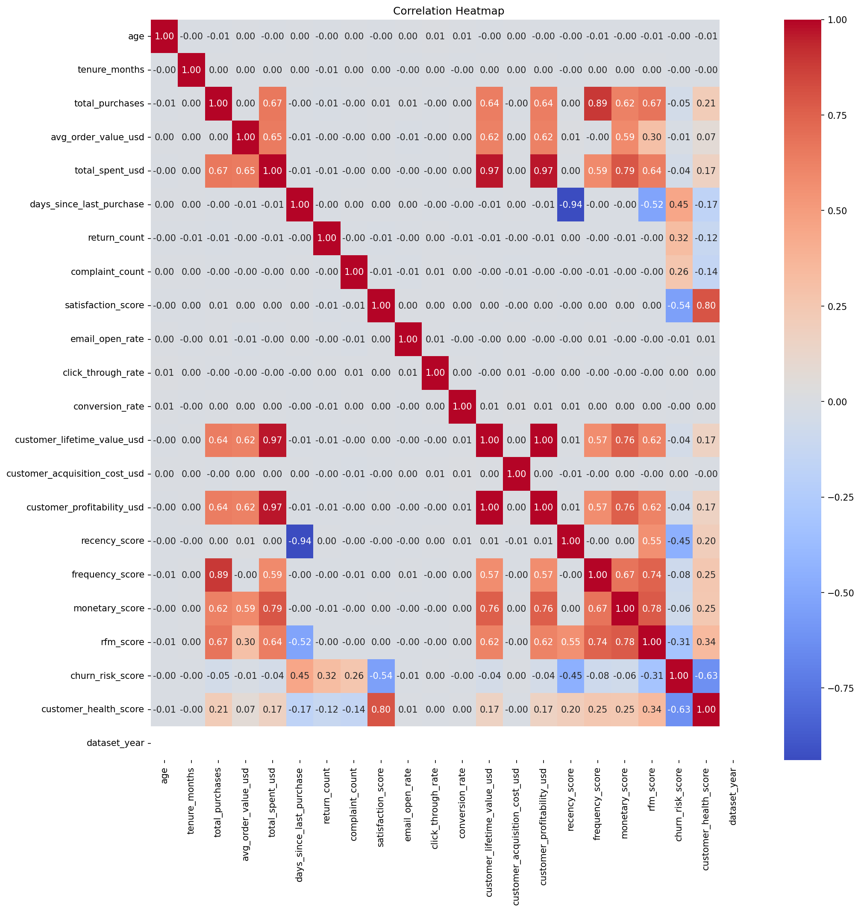
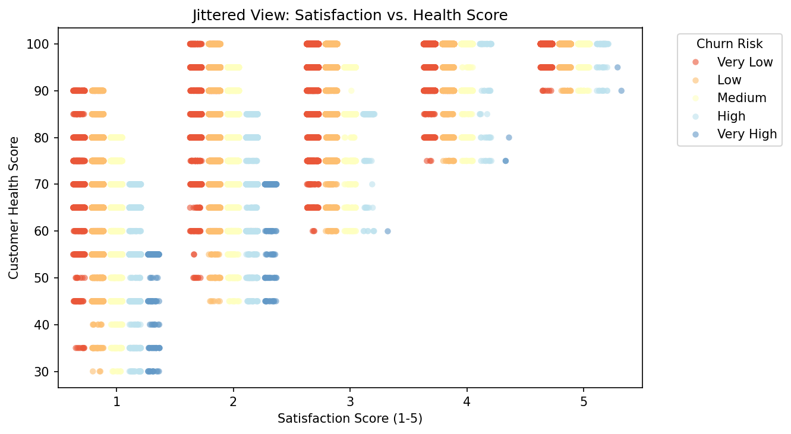
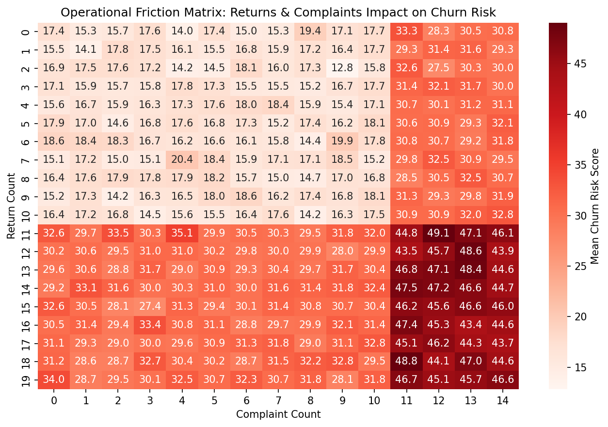
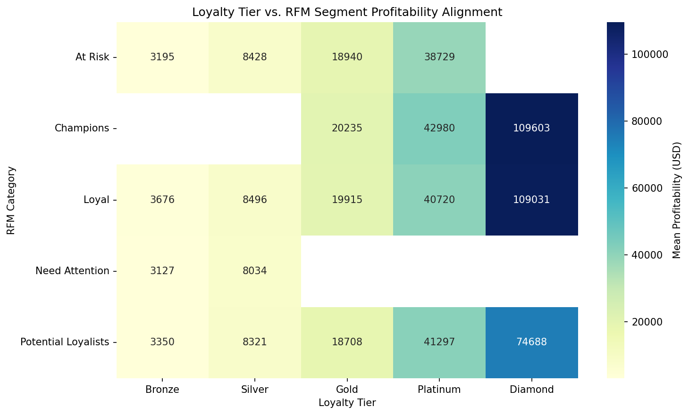
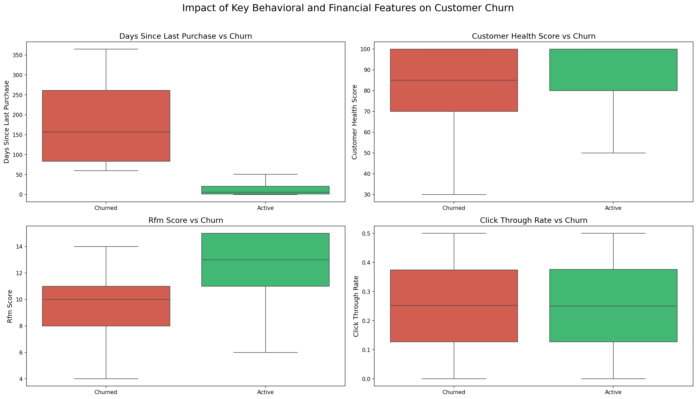

# E-commerce Customer Churn Prediction

This repository contains an end-to-end Machine Learning project focused on analyzing e-commerce customer behavior. It predicts customer churn for an e-commerce business, compares seven classification algorithms, identifies the strongest churn drivers, and translates model performance into an estimated financial impact (Customer Lifetime Value protected by a retention campaign).

**Language**  

 
**Data Manipulation**  


 
**Visualization**  


 
**Machine Learning**  


**Environment**  


---

## Table of Contents

1. [Project Overview](#-project-overview)
2. [Business Problem](#-business-problem)
3. [Dataset](#-dataset)
4. [Project Workflow](#-project-workflow)
5. [Exploratory Data Analysis](#-exploratory-data-analysis)
6. [Data Preparation](#-data-preparation)
7. [Modeling & Results](#-modeling--results)
8. [Feature Importance](#-feature-importance)
9. [Business Impact Analysis](#-business-impact-analysis)
10. [Installation & Usage](#-installation--usage)
11. [Repository Structure](#-repository-structure)
12. [Future Improvements](#-future-improvements)

---

## Project Overview

Acquiring a new customer is typically far more expensive than keeping an existing one. This project builds a supervised classification pipeline that flags customers who are likely to churn so that a retention team can act before the customer is lost.

**What this project covers:**

- Exploratory data analysis across demographics, purchasing behaviour, satisfaction and loyalty
- Churn label definition from customer activity status
- Ordinal and one-hot encoding of categorical features
- Benchmarking of **7 models**: Random Forest, Logistic Regression, KNN, Linear SVM, Gradient Boosting, Gaussian Naive Bayes and XGBoost
- A second modeling iteration with engineered features, leakage removal and native categorical handling in XGBoost
- Feature importance analysis
- Translation of model recall into dollars of customer lifetime value (CLV) at risk

---

## Business Problem

*Which customers are likely to churn, what drives that behaviour, and how much revenue can a targeted retention campaign realistically protect?*

For the answer to this question recall on the churn class matters most, besause every missed churner is lost lifetime value. Precision matters too, because every false alarm costs campaign budget. The project therefore evaluates models on **precision, recall and F1** for the churn class, not **accuracy** alone.

---
## Dataset
 
This project uses the **[E-Commerce Customer Segmentation Dataset 2026](https://www.kaggle.com/datasets/datascikhan/e-commerce-customer-segmentation-2026)** by *datascikhan* on Kaggle.
 
### Dataset highlights
 
| Property | Detail |
|---|---|
| File | `E-commerce_Customer_Segmentation_2026.csv` |
| Records | 50,000 customers |
| Features | 53 |
| Dataset year | 2026 |
| Source | [Kaggle: datascikhan/e-commerce-customer-segmentation-2026](https://www.kaggle.com/datasets/datascikhan/e-commerce-customer-segmentation-2026) |
| Target (this project) | `is_churned`, engineered from `activity_status` (see below) |
| Class balance | 34,649 active (69.3%) / 15,351 churned (30.7%) |
 
The dataset covers customer demographics and profiles, purchase behavior and spending, RFM scores and categories, Customer Lifetime Value (CLV), churn risk analysis, customer profitability, loyalty tiers, satisfaction and engagement metrics, shopping channels and device preferences, and behavioral segmentation.
 
### Main feature groups
 
| Group | Features |
|---|---|
| **Customer Profile** | `customer_id`, `customer_segment`, `segment_category`, `age`, `age_group`, `gender`, `country`, `city`, `income_bracket`, `education_level`, `employment_type`, `marital_status` |
| **Purchase Behavior** | `tenure_months`, `total_purchases`, `avg_order_value_usd`, `total_spent_usd`, `purchase_frequency`, `days_since_last_purchase` |
| **Product & Shopping Preferences** | `preferred_category_1`, `preferred_category_2`, `preferred_category_3`, `shopping_channel`, `device_used`, `payment_method` |
| **Customer Experience** | `return_count`, `complaint_count`, `satisfaction_score`, `satisfaction_level`, `loyalty_tier` |
| **Digital Engagement** | `email_open_rate`, `click_through_rate`, `conversion_rate`, `social_media_presence` |
| **Customer Value** | `customer_lifetime_value_usd`, `customer_acquisition_cost_usd`, `customer_profitability_usd` |
| **RFM & Risk** | `recency_score`, `frequency_score`, `monetary_score`, `rfm_score`, `churn_risk_score`, `customer_health_score` |
| **Segmentation & Classification** | `customer_value_category`, `activity_status`, `health_status`, `churn_risk_category`, `rfm_category`, `profitability_category`, `engagement_level`, `behavior_segment`, `device_preference`, `clv_category` |

### Target definition

```python
df['is_churned'] = df['activity_status'].isin(['Dormant', 'Inactive']).astype(int)
```

Customers with an activity status of **Dormant** or **Inactive** are labelled as churned (`1`); **Active** and **At Risk** customers are labelled as retained (`0`).

---

## Project Workflow

```
Raw CSV
   │
   ▼
Exploratory Data Analysis (8 visualisations)
   │
   ▼
Churn label engineering  ──►  Encoding (ordinal + one-hot)
   │
   ▼
Stage 1: Baseline model comparison (6 algorithms, scaled features)
   │
   ▼
Stage 2: Feature engineering + leakage removal + XGBoost (native categoricals)
   │
   ▼
Feature importance  ──►  Churn driver analysis
   │
   ▼
Financial impact estimate
```

---

## Exploratory Data Analysis

The notebook produces the following visualisations:

| # | Visualisation | Purpose |
|---|---|---|
| 1 | Count plot of customer volume by segment | Size of Consumer / Premium / Enterprise / Small Business groups |
| 2 | Age distribution histogram with KDE | Customer age profile |
| 3 | Bubble chart: income bracket vs. education level | Where the customer base is concentrated demographically |
| 4 | Scatter: total purchases vs. average order value (bubble = total spent, colour = loyalty tier) | Purchase volume vs. basket value across loyalty tiers |
| 5 | Correlation heatmap of numeric features | Multicollinearity and relationships with churn-related scores |
| 6 | Jittered strip plot: satisfaction vs. health score, coloured by churn risk | Relationship between satisfaction and customer health |
| 7 | "Operational friction" heatmap: returns × complaints → mean churn risk score | How service issues compound churn risk |
| 8 | Heatmap: RFM category × loyalty tier → mean profitability | Whether loyalty tiers align with RFM-based value |

---

### Visualisation gallery
 
**1. Customer volume by segment**
 


**2. Customer age distribution**
 


**3. Customer density: income bracket vs. education level**
 


**4. Purchase volume vs. order value (bubble size = total spent)**
 


**5. Correlation heatmap**
 


**6. Satisfaction vs. customer health score**
 


**7. Operational friction matrix: returns and complaints vs. churn risk**
 


**8. Loyalty tier vs. RFM segment profitability**
 


---


### Median comparison: churned vs. active customers

| Feature | Active | Churned | Difference |
|---|---|---|---|
| Days since last purchase | 6 | 157 | +2,517% |
| Customer health score | 100 | 85 | −15.0% |
| RFM score | 13 | 10 | −23.1% |
| Click-through rate | 0.250 | 0.252 | +0.8% |

Recency, health score and RFM score separate the two groups clearly. Click-through rate barely differs, suggesting email engagement alone is a weak churn signal.



---


## Data Preparation

### Encoding

| Type | Columns | Method |
|---|---|---|
| Binary | `gender` | Male → 0, Female → 1 |
| Ordinal | `education_level`, `income_bracket`, `purchase_frequency`, `loyalty_tier`, `engagement_level` | Manual rank mapping (e.g. Rarely=1 … Daily=5) |
| Nominal | `customer_segment`, `country`, `employment_type`, `marital_status`, `preferred_category_1`, `shopping_channel`, `device_used`, `payment_method` | One-hot encoding (`drop_first=True`) |

### Train / test split

- **80 / 20 split**, stratified on the target, `random_state=42`
- `StandardScaler` fitted on the training set only, then applied to the test set

### Feature Selection

For the first part of the comparison of the 6 models, features: `purchase_frequency`, `customer_segment`, `age`, `gender`, `country`, `income_bracket`, `education_level`, `employment_type`, `marital_status`, `tenure_months`, `total_purchases`, `avg_order_value_usd`, `total_spent_usd`, `preferred_category_1`, `shopping_channel`, `device_used`, `payment_method`, `return_count`, `complaint_count`, `satisfaction_score`, `loyalty_tier`, `email_open_rate`, `click_through_rate`, `conversion_rate`, `customer_acquisition_cost_usd`, `engagement_level` were selected manually based on correlation heatmap of numeric features.

### Engineered features

| Feature | Formula | Intuition |
|---|---|---|
| `purchase_velocity` | total purchases / (tenure + 1) | Buying pace over the relationship |
| `monthly_spend` | total spent / (tenure + 1) | Average monthly revenue |
| `return_rate` | returns / (purchases + 1) | Product dissatisfaction |
| `complaint_rate` | complaints / (purchases + 1) | Service dissatisfaction |
| `ctor` | click-through rate / (open rate + ε) | Click-to-open efficiency |
| `clv_cac_ratio` | CLV / (acquisition cost + 1) | Customer profitability vs. cost to acquire |
| `num_preferred_categories` | count of non-null preferred categories | Breadth of interest |
| `high_risk_dissatisfaction` | satisfaction ≤ 2 and complaints > 0 | Flag for unhappy, vocal customers |

### Leakage removal

Columns that directly encode or are derived from churn/recency were dropped to prevent target leakage:

`customer_id`, `activity_status`, `days_since_last_purchase`, `recency_score`, `rfm_score`, `rfm_category`, `churn_risk_score`, `churn_risk_category`, `customer_health_score`, `health_status`, `is_churned`

---

## Modeling & Results

All metrics are on the held-out test set (10,000 customers: 6,930 active, 3,070 churned).

### Stage 1 — Baseline model comparison

| Model | Accuracy | Churn Precision | Churn Recall | Churn F1 |
|---|---|---|---|---|
| Random Forest (100 trees) | 0.9018 | 0.81 | 0.89 | 0.85 |
| Logistic Regression | 0.9028 | **0.82** | 0.88 | 0.85 |
| K-Nearest Neighbors (k=5) | 0.7286 | 0.60 | 0.35 | 0.44 |
| Linear SVM (LinearSVC) | **0.9034** | **0.82** | 0.89 | 0.85 |
| Gradient Boosting (100 trees) | 0.9021 | 0.80 | 0.91 | 0.85 |
| Gaussian Naive Bayes | 0.9025 | 0.79 | **0.93** | 0.85 |

**Takeaways**

- Five of six models converge at roughly **90% accuracy and 0.85 churn F1**, suggesting the signal is captured well even by simple linear models.
- **KNN performs worst** (recall 0.35): distance-based methods struggle with the high-dimensional one-hot feature space.
- **Gaussian Naive Bayes and Gradient Boosting** deliver the highest churn recall, which matters most for a retention use case, at the cost of some precision.

### Stage 2 — XGBoost with engineered features

| Model | Accuracy | Churn Precision | Churn Recall | Churn F1 |
|---|---|---|---|---|
| XGBoost (300 trees, lr=0.03, depth=6) | **0.9040** | **0.83** | 0.86 | 0.85 |

Configuration: `subsample=0.8`, `colsample_bytree=0.8`, `enable_categorical=True`, `eval_metric='logloss'`.

XGBoost achieves the best accuracy and churn precision, trading a little recall for fewer false alarms.

---

## Feature Importance

### Stage 1 — Random Forest (top drivers)

| Rank | Feature | Importance |
|---|---|---|
| 1 | `purchase_frequency` | 0.674 |
| 2 | `customer_acquisition_cost_usd` | 0.021 |
| 3 | `email_open_rate` | 0.020 |
| 4 | `avg_order_value_usd` | 0.020 |
| 5 | `click_through_rate` | 0.020 |
| 6 | `total_spent_usd` | 0.019 |
| 7 | `conversion_rate` | 0.019 |
| 8 | `tenure_months` | 0.018 |
| 9 | `total_purchases` | 0.018013 |
| 10 | `total_puagerchases` | 0.017160 |
...

`purchase_frequency` accounts for roughly two-thirds of total importance; every other feature contributes about 2% or less.

### Stage 2 — XGBoost (top 15 by gain)

| Rank | Feature | Importance |
|---|---|---|
| 1 | `purchase_frequency` | 0.446 |
| 2 | `segment_category` | 0.219 |
| 3 | `behavior_segment` | 0.191 |
| 4 | `frequency_score` | 0.024 |
| 5 | `total_purchases` | 0.021 |
| 6 | `social_media_presence` | 0.006 |
| 7 | `city` | 0.006 |
| 8 | `total_spent_usd` | 0.003 |
| 9 | `loyalty_tier` | 0.003 |
| 10 | `preferred_category_2` | 0.003 |

**Interpretation:** purchase behaviour (how often a customer buys) is by far the strongest predictor of churn. Demographics, payment method and device contribute very little.

---

## Business Impact Analysis

**Method**

1. Identify true positives (actual churners the model flagged)
2. Sum their `customer_lifetime_value_usd`
3. Apply an assumed **30% campaign retention success rate** for a conservative estimate

**Results (test set, 10,000 customers)**

| Model | Churn Recall | Total CLV of all churners | CLV of identified churners | Estimated savings at 30% retention |
|---|---|---|---|---|
| Gaussian Naive Bayes | 93.0% | $181,222,484.63 | $165,925,856.02 | **$49,777,756.81** |
| XGBoost | 85.7% | $181,222,484.63 | $155,700,251.86 | **$46,710,075.56** |

Naive Bayes captures more CLV because of its higher recall, while XGBoost flags fewer false positives, which would lower wasted campaign spend. The right choice depends on the cost of a retention offer versus the value of a saved customer.

---

## ⚙️ Installation & Usage

### 1. Clone the repository

```bash
git clone https://github.com/<your-username>/<your-repo-name>.git
cd <your-repo-name>
```

### 2. Create a virtual environment (recommended)

```bash
python -m venv venv
source venv/bin/activate        # macOS / Linux
venv\Scripts\activate           # Windows
```

### 3. Install dependencies

```bash
pip install -r requirements.txt
```

Or install manually:

```bash
pip install pandas numpy matplotlib seaborn scikit-learn xgboost shap jupyter ipywidgets
```

### 4. Add the dataset

Place `E-commerce_Customer_Segmentation_2026.csv` in the `data/` folder and update the path in the notebook. Use a **relative path** rather than a machine-specific absolute path:

```python
df = pd.read_csv('data/E-commerce_Customer_Segmentation_2026.csv')
```

### 5. Run the notebook

```bash
jupyter notebook churn_prediction.ipynb
```

Run the cells top to bottom.

---

## Repository Structure

```
├── data/
│   └── E-commerce_Customer_Segmentation_2026.csv
├── churn_prediction.ipynb       
├── requirements.txt
├── images/
│   ├── 01_customer_volume_by_segment.png
│   ├── 02_age_distribution.png
│   └── ...
└── README.md
```

*(Adjust file names to match your repository.)*

---

## Future Improvements

- Verify and remove possible label leakage.
The churn label comes from `activity_status`, and some features left in the Stage 2 model (`segment_category`, `behavior_segment`, `frequency_score`) may be derived from customer activity. Their high importance (0.22, 0.19 and 0.02) suggests they could be encoding the target. 
- Investigate the dominance of `purchase_frequency`. 
It explains 45–67% of feature importance, and most models stabilize at about 90%.
- Add k-fold cross-validation and hyperparameter tuning.
- Handle class imbalance and compare the results.


---

